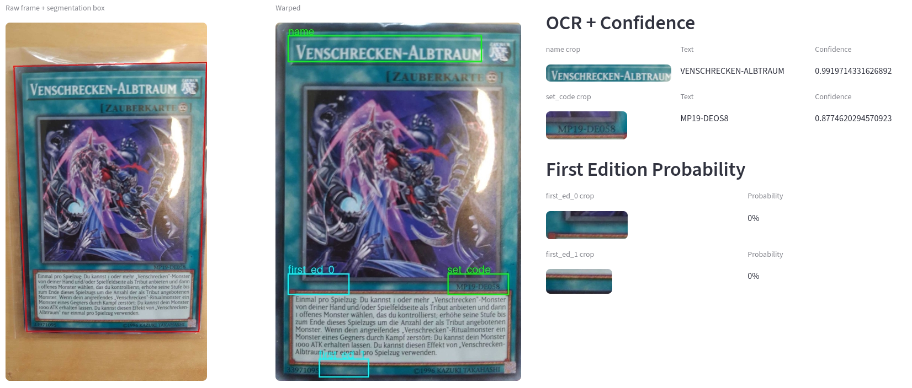

# TCG Scanner

> [!NOTE]
> Work in progress


TCG Scanner is an end-to-end **computer vision** pipeline for **real-time** trading card identification, built with production-grade **MLOps/Data Engineering** practices.

**Service** (Dockerized, GPU-accelerated, exposed via REST API):
- **YOLO segmentation** — localizes cards in the camera feed
- **Perspective warping** — extracts a flat, undistorted card image
- **PaddleOCR** — recognizes card text
- **ResNet18 classifier** — detects whether the card is **1st Edition**

**Client**:
- Stabilizes detections across frames until results **converge**
- Matches converged results against a **product catalog**
- Exports detection + product data as a **CSV**, ready for automated listing on resale platforms

## Demo

## Motivation

I've loved Yu-Gi-Oh since I was a kid, and recently turned that into a small side business selling cards. The problem: the marketplace I sell on only supports manual, click-by-click listing — no bulk tools, no shortcuts. For more than a handful of cards, that's both slow and genuinely exhausting on the eyes.

I ended up subscribing to [TCG Powertools](https://tcgpowertools.com/) for its CSV bulk-upload feature, but I still had to manually identify every card and build the CSV myself. Since I didn't want to spend hours doing that by hand, I decided to automate the entire process — cards are held up one by one to a live camera feed, identified automatically, and compiled into a ready-to-upload CSV.

## Pipeline

Visual walkthrough of the CV pipeline running inside the service, read **right to left**. Every step below happens **on every single frame**, extracting the raw data needed for identification.



This extracted data is then handed to the client, where results are stabilized across frames until they **converge** — only then is the card looked up in the product catalog and considered identified.

## Output

Each identified card is appended to a CSV file, structured for direct bulk-upload to the resale platform:

| cardmarketId | quantity | name | set | cn | condition | language | isFirstEd | price | comment |
|---|---|---|---|---|---|---|---|---|---|
| 315651 | 1 | Harvest Angel of Wisdom | Structure Deck: Wave of Light | 007 | NM | German | True | 1000.0 | Daily shipping |
| 372826 | 1 | Super Quantum White Layer | Dark Neostorm | 013 | NM | German | False | 1000.0 | Daily shipping |

> [!NOTE]
> By design `price` is a default value — [TCG Powertools](https://tcgpowertools.com/) provides auto-pricing functionality once the CSV is imported.

Full example: [`docs/example_csv.csv`](docs/example_csv.csv)

## Requirements

- Docker + Docker Compose
- NVIDIA GPU + nvidia-container-toolkit
- Android phone with [IP Webcam](https://play.google.com/store/apps/details?id=com.pas.webcam) app installed
- USB cable + [ADB](https://developer.android.com/tools/adb) (Android Platform Tools) installed on the host
- USB debugging enabled on the phone

```bash
sudo apt install nvidia-container-toolkit
sudo nvidia-ctk runtime configure --runtime=docker
sudo systemctl restart docker
```

### Camera setup

The service expects the video stream at `127.0.0.1:8080` (currently hardcoded). To get the phone's stream there:

1. Connect the phone via USB, with USB debugging enabled
2. Forward the port from the phone to the host:
```bash
adb devices
adb forward tcp:8080 tcp:8080
```
3. Start the server in the IP Webcam app (default port `8080`)

## Usage

Make sure `adb forward tcp:8080 tcp:8080` is active (see [Camera setup](#camera-setup)) before starting the client.

```bash
docker compose up -d
python -m client.inference.main --condition NM
```

The first build takes a few minutes — PaddleOCR models are downloaded and baked into the image. Subsequent starts are fast.

### Arguments

| Flag | Description |
|---|---|
| `--condition` | Card condition (e.g. `NM`, `EX`) applied to **all** cards in this run. Condition detection isn't implemented yet, so this is set once at startup rather than per card — works well if you sort your physical cards by condition beforehand. |
| `--debug` | Saves every processing step of every frame, viewable afterward via `client.debug.main` (this is how the [pipeline walkthrough](#pipeline) screenshot was created). |
| `--record` | Records the stream as a video with progress bars overlaid (see the [demo](#demo) above). |
| `--frame-skip` | Only processes every Nth frame to reduce load. Default: `10`. |


## Related

- [tcgscanner-ml](https://github.com/kevler287/tcgscanner-ml) — Training pipeline, synthetic data generation, and model weights